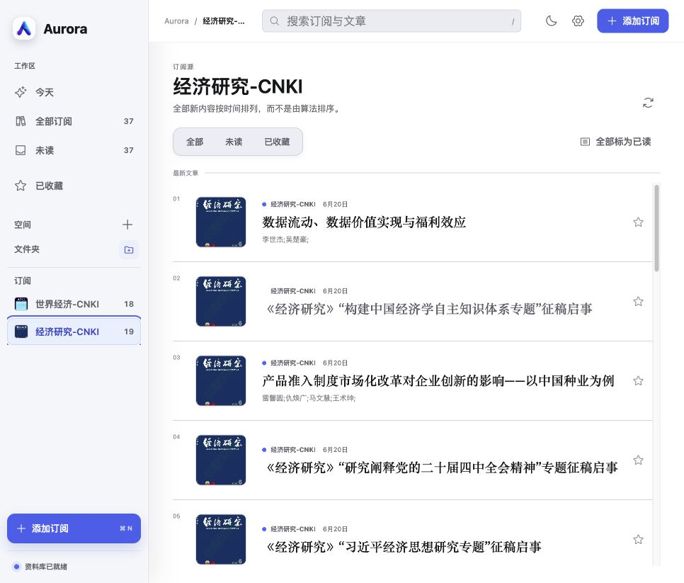
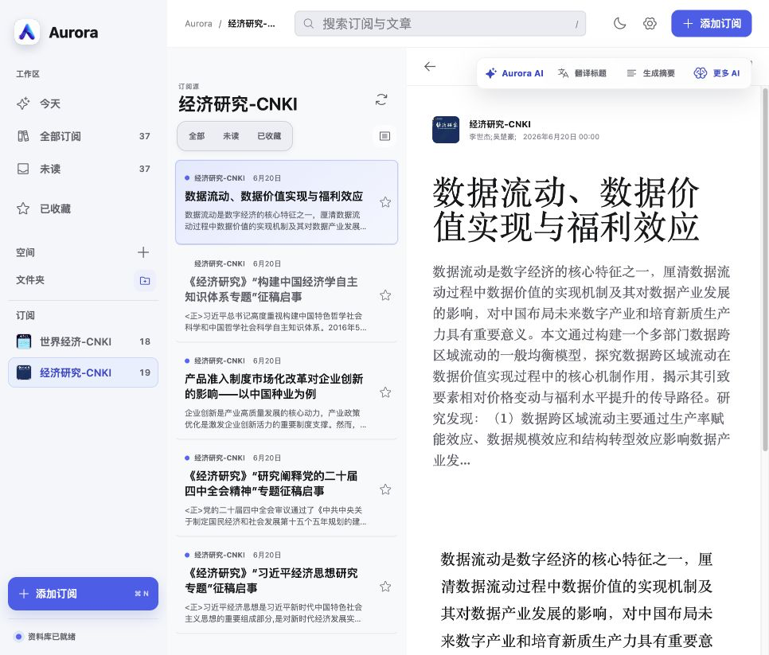
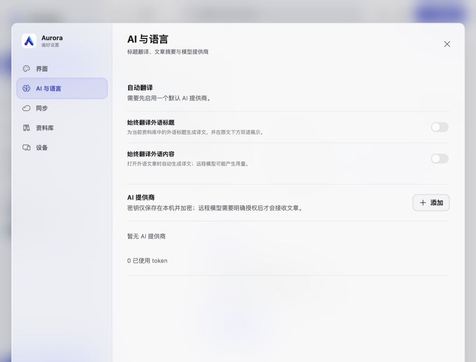

# ReFlow

[English](README.md) · 简体中文

ReFlow 是一款本地优先的 RSS 阅读器，支持 macOS、Windows、iPad 和 Web。它提供安静的三栏阅读流程，由 Go 服务负责订阅抓取、SQLite 存储、刷新调度、同步、搜索和可选的 AI 任务。


## 功能

- 侧栏、文章列表和阅读器组成的可调整三栏工作区
- RSS、Atom、JSON Feed、RSSHub、OPML 和全文提取
- ETag/Last-Modified 条件刷新、自动轮询和多键文章去重
- 空间、文件夹、标签、已收藏、稍后阅读、规则和快捷键
- OpenAI 兼容接口与 Ollama；标题翻译、文章摘要、全文翻译、要点和文章对话
- 可选的外语标题双语展示，以及打开文章时自动翻译内容
- FreshRSS、Google Reader、Miniflux、Fever、Feedbin 和 Nextcloud News 同步
- WebDAV 与 iCloud Drive 资料库同步，支持冲突检测和明确恢复
- `reflow` 命令行工具，让 AI 代理或脚本在应用外操作科研工作台：创建在投论文、维护标签、从订阅文章识别文献
- 中英文界面、浅色/深色主题和五种时间线视图

## 截图







## 安装

从 [GitHub Releases](https://github.com/Zijinn/ReFlow/releases) 下载最新安装包：

- `ReFlow-<version>-macos-universal.dmg`：支持 Apple silicon 和 Intel Mac
- `ReFlow-<version>-windows-x64-setup.exe`：支持 Windows 10/11

原生安装包由 GitHub Actions 构建。Web 版也可以直接作为 PWA 使用。

## 跨设备同步

WebDAV 和 iCloud Drive 保存的是完整 ReFlow 资料库快照。第一台设备先选择“以本地资料库覆盖云端”；其他 Mac 或 Windows 设备连接同一个 WebDAV 目录或登录同一 Apple ID 后，选择“从云端恢复资料库”。之后只有一端变更时会自动同步，两端同时变更则会停止并要求选择保留哪份。

iCloud 模式依赖操作系统将 `iCloud Drive/ReFlow/reflow-library.json` 同步到本机，因此只支持已启用 iCloud Drive 的 macOS 和 Windows。iPad PWA 不会直接读取该文件，而是连接一台正在运行 ReFlow 服务的电脑。

## 开发

需要 Go 1.25+、Node.js 22+ 和 pnpm 11：

```bash
pnpm install
pnpm --dir web install
pnpm dev
```

开发服务地址：

- Web：`http://127.0.0.1:4173`
- API：`http://127.0.0.1:7381`

完整检查：

```bash
make check
bash scripts/check-release-config.sh
```

`reflow` 命令行工具只依赖 Go，无需打包前端资源，它通过 REST API 操作正在运行的服务：

```bash
make cli
./bin/reflow describe
```

[docs/cli.md](docs/cli.md) 说明它的代理调用约定：JSON 返回结构、退出码、字段规则与文献识别的判定阈值。REST 接口定义见 [api/openapi.yaml](api/openapi.yaml)，架构与安全说明见 [docs](docs)，阅读器交互的研究底稿见 [research_rss_reader_references](research_rss_reader_references)。

## AI 与隐私

AI 功能默认关闭。提供商密钥在本机加密保存，不会通过 REST API 返回。远程模型只有在明确授权后才会接收文章内容；本地 Ollama 可保持在设备内运行。自动翻译开关会在设置中单独控制标题和文章内容翻译。

## 数据与安全

SQLite 是资料库的权威存储。应用默认只绑定本机回环地址；开启局域网访问需要一次性设备配对。同步目标只保存资料库快照，不在项目文档或截图中记录个人账号信息。

## 许可证

ReFlow 使用 GPL-3.0-only，详见 [LICENSE](LICENSE) 和 [THIRD_PARTY_NOTICES.md](THIRD_PARTY_NOTICES.md)。
